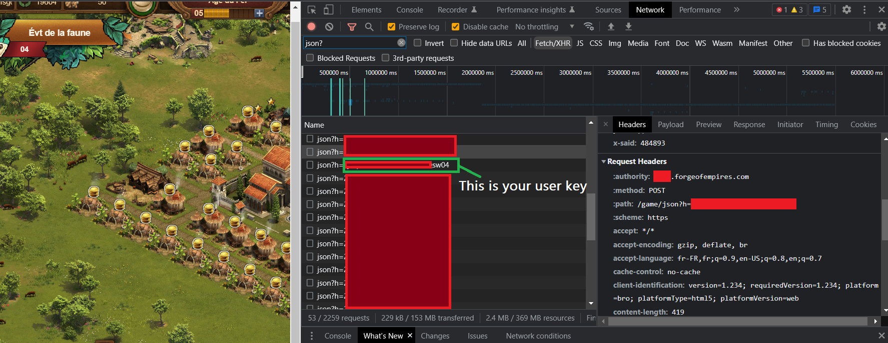
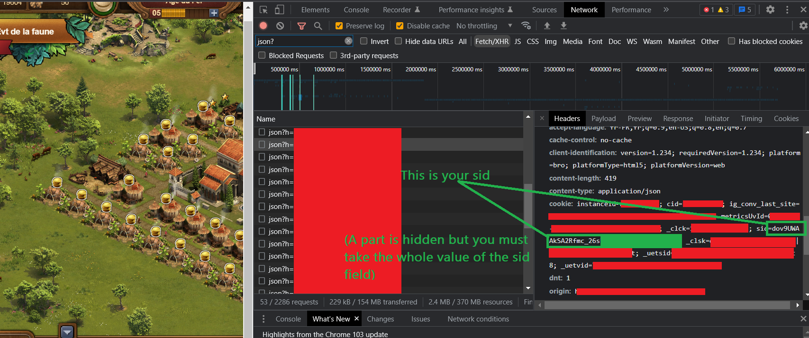
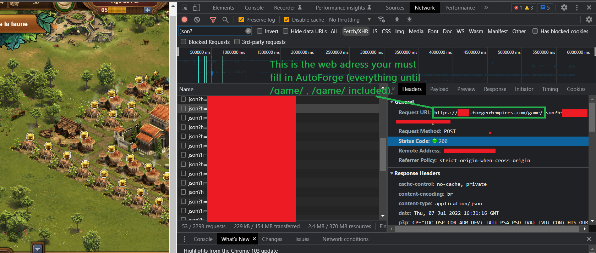
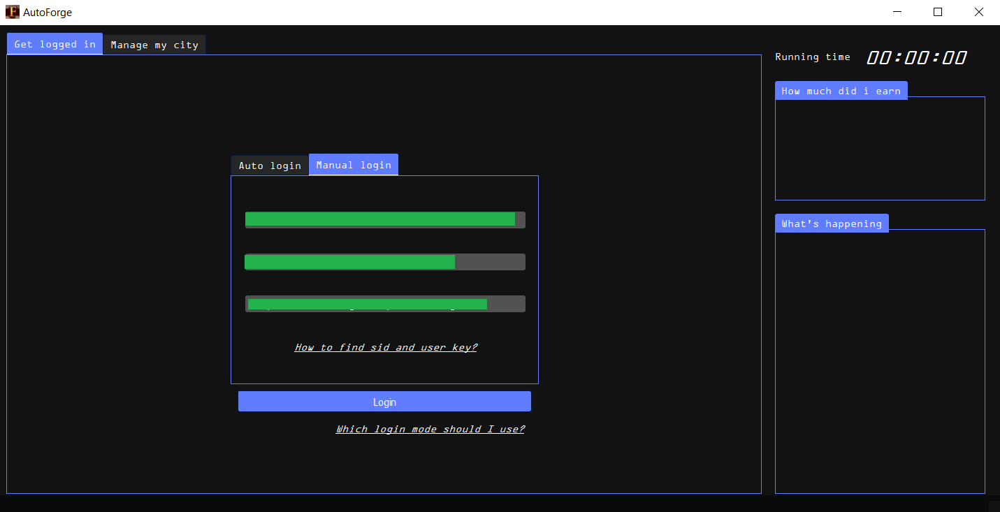
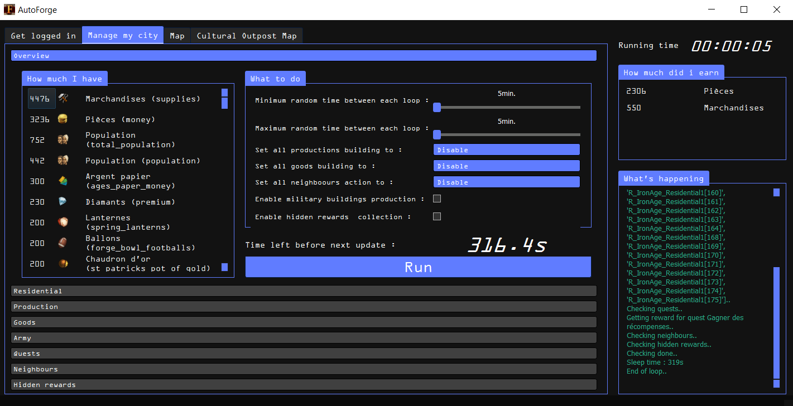
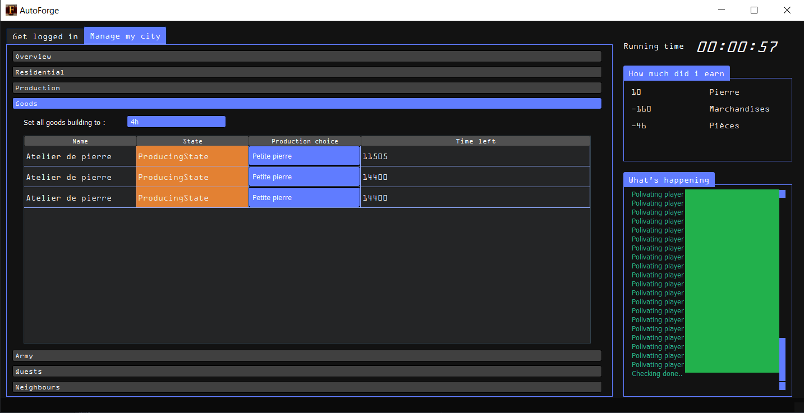
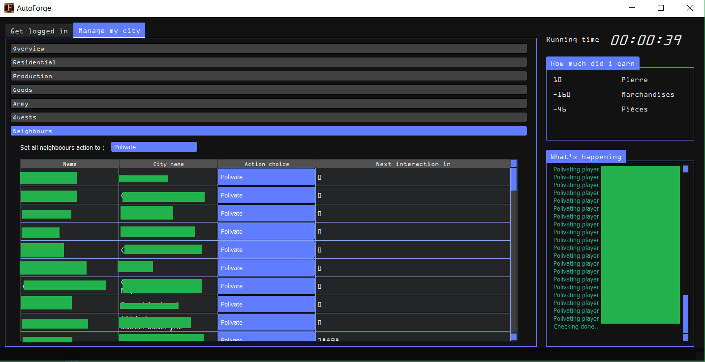

<h1>AutoForge</h1>
<h4>Free up-to-date bot for Forge of Empires</h4>
Current version : v0.2  
Foe latest supported version : 1.236
<b>If you use the bot, please start the repo</b>

<h2>Summary</h2>
<ol>
 <li> <a href="#download">Download</a></li>
 <li> <a href="#installation">Installation</a></li>
 <li> <a href="#run">Run</a></li>
 <li> <a href="#features">Features</a></li>
 <li> <a href="#screenshots">Screenshots</a></li>
 <li> <a href="#report_bug">Report bug</a></li>
</ol>

<h2>Features</h2>
<ul>
  <li>Harvest all buildings automatically.</li>
  <li>Start production automatically of:
    <ul>
      <li> Goods buildings</li>
      <li>Supplies buildings</li>
      <li> Military buldings</li>
     </ul>
    </li>
  <li>Polivate players automatically.</li>
  <li>Flood other players with custom message (<b>BAN RISK</b>)</li>
  <li>Get reward of terminated quests automatically.</li>

   

<h2>Download</h2>
To download latest release, go to <a href="https://github.com/ThScEo/AutoForge/releases">Releases</a> and download the latest release.

<h2>Installation</h2>
<ol>
  <li>Unzip AutoForge_vxx.rar</li>
  <li>Run AutoForge.exe</li>
</ol>

<h2>Run</h2>
 <h3>To connect with AutoForge, you need 3 variables:</h3>
 <ol>
  <li>Your SID</li>
  <li>Your User Key</li>
  <li>The web adress which display when you play on your computer</li>
 </ol>
 <h3>To get theses variables you need to follow theses steps:</h3>
 <ol>
  <li>Connect to Forge Of Empires through your browser</li>
  <li>Once done and the game is loaded, open the developper toolbox (CTRL+MAJ+I) on Google Chrome, this can be different on other navigators)</li>
  <li>Open the "Network" tab and find any message which request url looks like "json?h=something", select it on the developper toolbox by clicking.</li>
  <li>Your User Key is the value after the "json?h=your_user_key_is_here". Copy its value and fill the field "user_key" in Autoforge with it.
  </li>
  <li>Your SID is the value of the sid cookie. To find it, select the "Headers" tab, scroll down to the "Request Headers" section, and find the "cookie" field. Copy the value of the sid only, and fill the field "sid" in AutoForge with it. </li>
  <li>The web adresse is the URL displayed on your navigator when playing Forge Of Empires.  
   For example: "https://es21.forgeofempires.com/game/"</li>
 </ol>
 

<h2>Screenshots</h2>
<ul>
<li>Login window </li>
<li>Management window </li>
<li>Goods buildings management </li>
<li>Neighbours management </li>
</ul>

