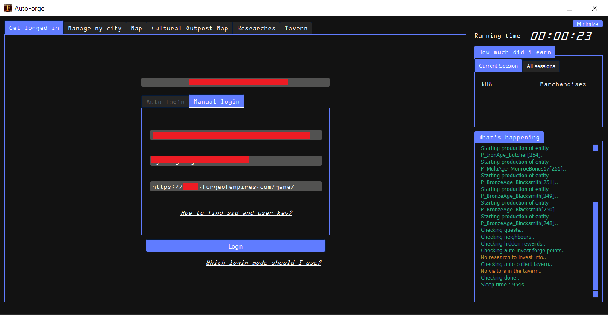
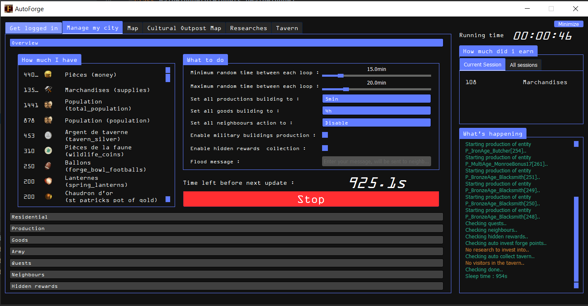
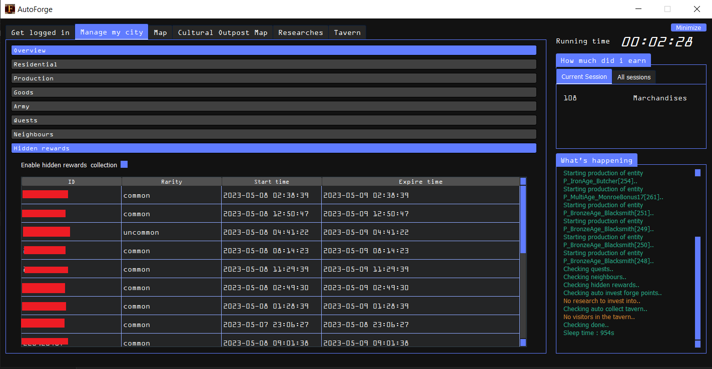
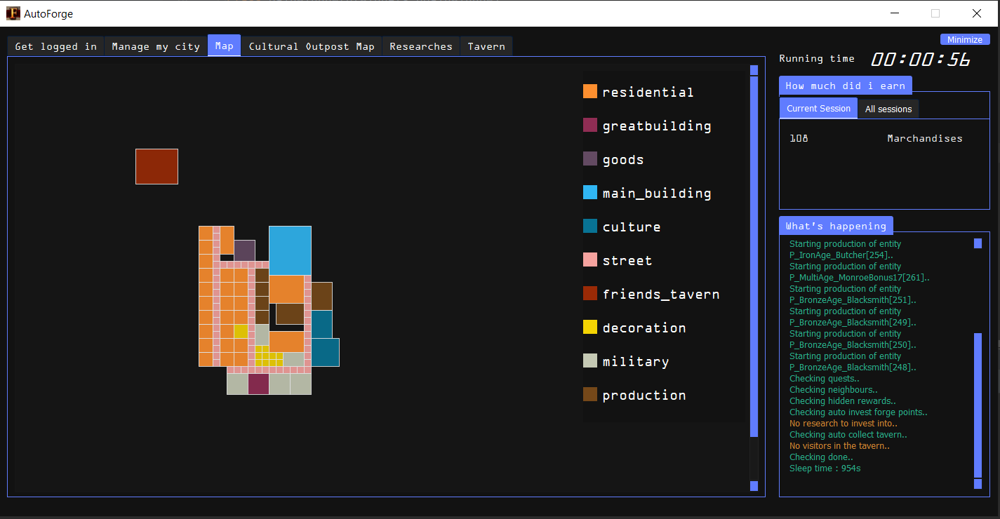
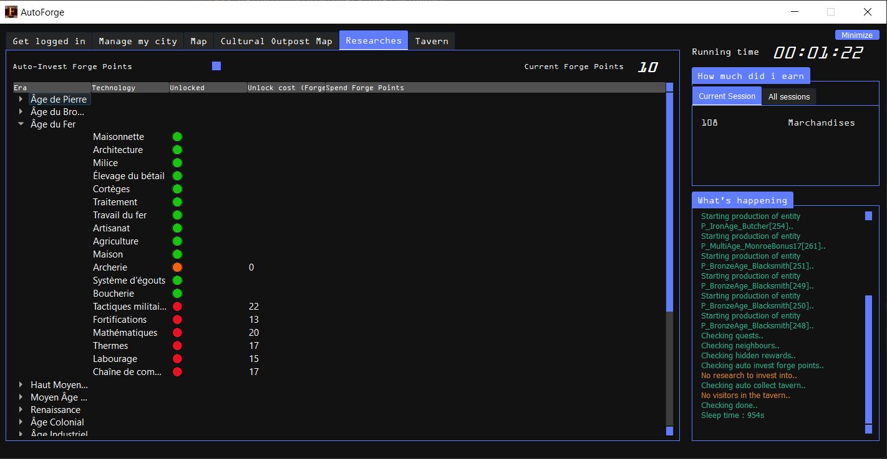
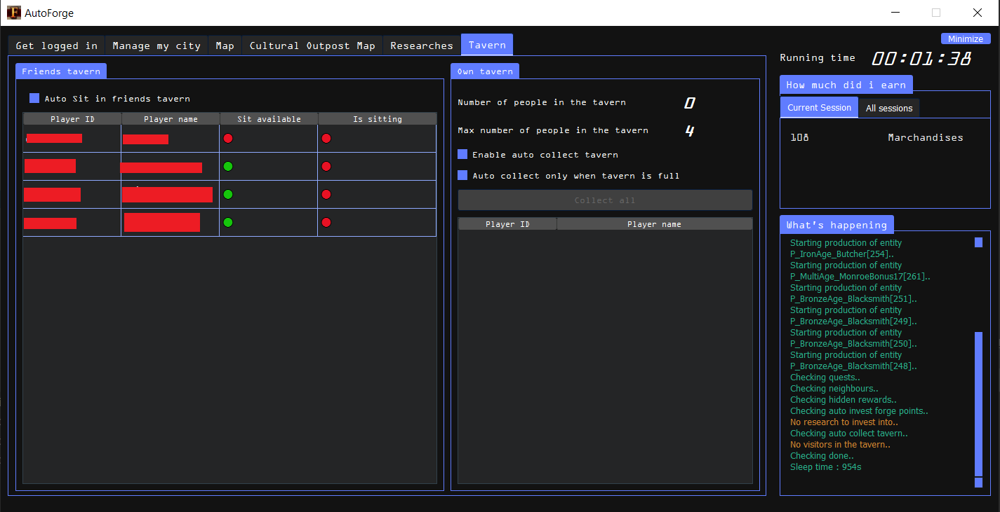
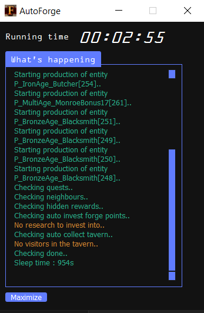

<h1>🛠️ AutoForge 🛠️</h1>
<h4>💲 Free Up-to-date bot for Forge of Empires 💲 </h4>
➡️ Current version : v0.4.8  
➡️ Foe latest supported version : <b> 1.287(28/07/2024) </b> 
<h2><b>If you use the bot, please star the repo</b></h2>
<i><b>If you want new features, please open an issue</b></i>

<h2>📘 Summary</h2>
<ol>
 <li> <a href="#features">📑 Features</a></li>
 <li> <a href="#licenses">✨ Buy a license key Or try the bot with key EITTX-IQPXX-NURZG-WKWYK or DFNHD-TMRSA-UYFUV-XFCZB </a></li>
 <li> <a href="#download">📩 Download</a></li>
 <li> <a href="#installation">💻 Installation</a></li>
 <li> <a href="#run">🏃‍♂️ Run the bot </a></li>
 <li> <a href="#screenshots">📷 Screenshots</a></li>
 <li> <a href="#report_bug">🐞 Report bug</a></li>
</ol>

<h2>📑 Features</h2>
<ul>
  <li>🥣 Harvest all buildings automatically. <b>(✔️Free)</b></li> 
  <li>🏗️ Start production automatically of:
    <ul>
      <li> 🥗 Goods buildings <b>(✔️Free)</b></li>
      <li> 📦 Supplies buildings <b>(✔️Free)</b></li>
      <li> 🎖️ Military buldings <b>(✔️Free)</b></li>
     </ul>
    </li>
  <li>👨‍👩‍👦‍👦 Flood other players with custom message (<b>BAN RISK</b>) <b>(✔️Free)</b></li>
  <li>🛠️ You can configure a random sleep time between each loop. <b>(✔️Free)</b></li>
  <li>🛠️ You can minimize the window to let only the logs viewable. <b>(✔️Free)</b></li>
  <li>🛠️ Display user's city in "Map" tab. <b>(✔️Free)</b></li>
  <li>💫 Get reward of terminated quests automatically. <b>(💲Premium)</b></li>
  <li>💫 Polivate players automatically. <b>(💲Premium)</b></li>
  <li>💫 Collect hidden rewards automatically. <b>(💲Premium)</b></li>
  <li>💫 Auto Spend Forge points into researches. <b>(💲Premium)</b></li>
  <li>💫 Auto collect tavern & Auto sit at friends taverns. <b>(💲Premium)</b></li>

   

<h2>✨ How to buy a license or try the bot with free license key</h2>
<h3>1️⃣ If you want to use only free features, use one of theses keys (each is limited to 600 so if one is not working, try another) : </h3> 
 <ul>
  <li><b>EITTX-IQPXX-NURZG-WKWYK</b></ul>
  <li><b>DFNHD-TMRSA-UYFUV-XFCZB</b></ul>
</ul>

<h3>2️⃣ Buy Premium license </h3>h>
You can buy a monthly license, or a lifetime license. All features will be available.
<ul> 
 <li>💲 To buy 30-days full-features licenses (<b>4€ / 30 days</b>), you must use <a href="https://app.cryptolens.io/Form/P/XCCDJ4P6/1601">the following form</a></li>
 <li>💲 To buy lifetime full-features licenses (<b>50€ / LIFETIME</b>), you must use <a href="https://app.cryptolens.io/Form/P/XCCDJ4P6/2216">the following form</a></li>
</ul>
<b>✔️ You will receive you key immediatly after payment. Next, you can then enter your key in the bot, then enjoy. Thank you for your support!</b>

<h2>📩 Download</h2>
To download latest release, go to <a href="https://github.com/ThScEo/AutoForge/releases">Releases</a> and download the latest release.

<h2>💻 Installation</h2>
<ol>
  <li>Unzip AutoForge_vxx.rar</li>
  <li>Run AutoForge.exe</li>
  <li><b>If you don't buy a license, don't forget to set the license as one of: 
    <li>
  <ul><b>EITTX-IQPXX-NURZG-WKWYK</ul>
  <ul>DFNHD-TMRSA-UYFUV-XFCZB</ul></b>
</li>
</ol>

<h2>🏃‍♂️ Run</h2>
 <i>If you don't see the big blue button "run", Then you should try to set your screen resolution to 100%</i>
 <h3>To connect with AutoForge, you need 3 variables:</h3>
 <ol>
  <li>Your SID</li>
  <li>Your User Key</li>
  <li>The web adress which display when you play on your computer</li>
 </ol>
 <h3>To get theses variables you need to follow theses steps:</h3>
 <ol>
  <li>Connect to Forge Of Empires through your browser</li>
  <li>Once done and the game is loaded, open the developper toolbox (CTRL+MAJ+I) on Google Chrome, this can be different on other navigators)</li>
  <li>Open the "Network" tab and find any message which request url looks like "json?h=something", select it on the developper toolbox by clicking.</li>
  <li>Your User Key is the value after the "json?h=your_user_key_is_here". Copy its value and fill the field "user_key" in Autoforge with it.
  </li>
  <li>Your SID is the value of the sid cookie. To find it, select the "Headers" tab, scroll down to the "Request Headers" section, and find the "cookie" field. Copy the value of the sid only, and fill the field "sid" in AutoForge with it. </li>
  <li>The web adresse is the URL displayed on your navigator when playing Forge Of Empires.  
   For example: "https://es21.forgeofempires.com/game/"</li>
 </ol>
 

<h2>📷 Screenshots</h2>
<ul>

</ul>

